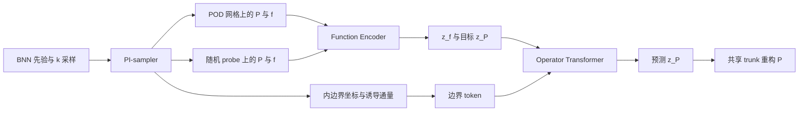

# 固定环域 SNO 实施方案

> **定位**：在固定环域上学习参数化椭圆型方程的前向算子。本文档以当前实现
> `annulus_sno_annulus_only_v2/annulus_sno_annulus_only_v2/` 及 Notebook 的运行配置为准；
> 当前实验将 `cfg.r_inner` 设为 `0.2`、`cfg.r_outer` 设为 `1.0`。同级 `data/`
> 目录保留早期实验脚本与结果，不应与当前实现的检查点混用。

## 1. 问题、目标与边界约定

在固定环域

$$
\Omega=\{(x,y): 0.2\le r=\sqrt{x^2+y^2}\le 1.0\}
$$

上求解

$$
\Delta P-k^2P=f.
$$

外边界施加 Dirichlet 条件，内边界施加 Neumann 条件：

$$
P(1.0,\theta)=0,\qquad \partial_nP(0.2,\theta)=g(\theta).
$$

内边界是流体域的孔洞边界，其外法向为 $n=-e_r$，因此

$$
\partial_nP=-\partial_rP.
$$

模型学习的是前向算子

$$
\mathcal G:\bigl(f,g,k\bigr)\mapsto P,
$$

而不是仅凭 PDE 反演 $k$。若要开展参数反演，需另行加入观测数据、可辨识性分析和反问题损失。

## 2. 设计原则

1. **固定几何直接建模**：环域本身就是参考域；不映射到单位圆或其他规范域。
2. **外边界硬约束，内边界由场诱导**：PI-sampler 强制 $P=0$ 于 $r=1.0$，训练样本的内边界通量从构造场自动求导得到。
3. **编码与算子学习分阶段进行**：先学习 $P$、$f$ 的连续表示，再学习输入 latent 到解 latent 的映射。
4. **物理量在物理尺度上验收**：归一化用于优化稳定性，边界条件和 PDE 残差均回到物理尺度解释。

## 3. 端到端数据流

### 3.1 PI-sampler

每个样本先从 BNN 先验生成原始场 $U_{\mathrm{raw}}(x,y)$，再构造

$$
P(x,y)=(r-r_{\mathrm{out}})U_{\mathrm{raw}}(x,y),
\qquad r_{\mathrm{out}}=1.0,
$$

从而严格满足外边界条件。利用自动微分计算

$$
f=\Delta P-k^2P.
$$

内边界通量不作为硬编码 ansatz 的一部分，而是按同一构造场计算。代码中的通量表达为

$$
g=-\left[U_{\mathrm{raw}}+(r_{\mathrm{in}}-r_{\mathrm{out}})
\partial_rU_{\mathrm{raw}}\right]_{r=r_{\mathrm{in}}}.
$$

POD 网格与 probe 点必须使用同一 BNN 实现的不同空间取值；否则输入场、监督场与边界通量将不属于同一个 PDE 样本。

### 3.2 `SampleBatch` 契约

|字段|含义|典型形状|
|---|---|---|
|`pod_coords`|规则环域网格，供 branch 编码|`[N_pod, 2]`|
|`probe_coords`|Sobol 随机查询点，供重构和物理损失|`[N_probe, 2]`|
|`u_pod`、`f_pod`|POD 网格上的解与源项|`[B, N_pod]`|
|`u_probe`、`f_probe`|probe 点上的解与源项|`[B, N_probe]`|
|`boundary_coords`|内边界笛卡尔坐标|`[B, N_\theta, 2]`|
|`boundary_flux`|诱导 Neumann 通量|`[B, N_\theta]`|
|`k_values`|PDE 参数|`[B]`|

有效批量为 $B=n_{\mathrm{repeat}}\,B_{\mathrm{sub}}$；代码中对应 `num_repeats * sample_size`。当前默认配置下，$N_\theta=128$、$N_r=32$、$N_{\mathrm{probe}}=1024$。

## 4. Function Encoder

Function Encoder（FE）将 $P$ 与 $f$ 分别编码为 $n_{\mathrm{basis}}$ 维 latent：

$$
z_P=E_P(P),\qquad z_f=E_f(f).
$$

结构采用两个 CNN branch（分别处理 $P$ 和 $f$）与一个共享 trunk。对任一 latent $z$，在坐标 $x$ 处的归一化重构为

$$
\hat q(x)=\frac{1}{\sqrt{n_{\mathrm{basis}}}}
\sum_{j=1}^{n_{\mathrm{basis}}}z_jT_j(x).
$$

### 4.1 归一化与损失

训练前从 PI-sampler 样本估计 $P$、$f$ 的全局均值与标准差，并在 branch 输入与数据重构损失中使用。当前 FE 优化目标为

$$
\mathcal L_{\mathrm{FE}}
=\mathrm{MSE}(\hat P,P)
+\mathrm{MSE}(\hat f,f)
+\lambda_{\mathrm{phys}}
\mathrm{MSE}\!\left(
\frac{\Delta\hat P-k^2\hat P-f}{\sigma_f}
\right).
$$

物理项通过 trunk basis 的自动微分得到 $\Delta\hat P$，并在物理尺度上构造残差后以 $\sigma_f$ 归一化。它的作用是约束 latent/trunk 表示保留可微分的 PDE 结构，而不仅是拟合网格值。

## 5. Operator Transformer

Transformer 学习

$$
(z_f,\,\text{boundary tokens},\,k)\mapsto z_P.
$$

输入由三部分组成：

|输入|构造方式|作用|
|---|---|---|
|源项 token|将 $z_f$ 切分为 `seq_chunks` 段|表示源项函数|
|边界 token|将 $[x_b,y_b,g_b]$ 按边界段拼接|同时携带位置与通量|
|参数 token|标量 $k$ 经线性嵌入|表示 PDE 参数|

三类 token 拼接后送入 encoder-only Transformer，经位置编码、多头自注意力、池化和线性层输出预测 latent $\hat z_P$。训练损失为

$$
\mathcal L_{\mathrm{OL}}=\mathrm{MSE}(\hat z_P,z_P).
$$

评估时还应通过 FE trunk 将 $\hat z_P$ 重构为物理解，并报告相对 $L_2$ 误差。

## 6. 训练与验收流程

|阶段|目标|必须检查|
|---|---|---|
|0. 小规模冒烟测试|确认形状、设备与随机数流|`n_basis` 可被 `seq_chunks` 整除；`theta_size` 可被 `cond_chunks` 整除|
|1. sampler 验证|验证生成样本自洽|$P=0$ 于外边界；$f=\Delta P-k^2P$；POD/probe 使用同一 BNN 实现|
|2. 归一化|建立稳定训练尺度|$P$、$f$ 的均值和标准差均有限且非零|
|3. FE 训练|学习连续场表示|重构 RL2、PDE 残差、边界残差|
|4. OL 训练|学习 latent 算子|latent MSE 与重构后的物理解 RL2|
|5. 基准验证|验证目标工况|解析解或独立 BVP/FEM 解、$f=0$、指定 $g(\theta)$ 与 $k$|

对于 $f=0$、$g(\theta)=\cos\theta$ 的基准，不应复用随机 PI-sampler 的诱导通量；须显式构造目标边界 token，并与独立解析/BVP 参考解比较。

## 7. 当前配置基线

|类别|默认值|
|---|---|
|几何|Notebook 覆盖为 `r_inner=0.2`，`r_outer=1.0`|
|参数范围|`k_min=k_max=1.0`|
|采样|`sample_size=256`，`num_repeats=3`，`theta_size=128`，`radial_size=32`|
|latent|`n_basis=512`|
|FE|CNN branch，`fe_steps=100000`，`fe_phys_weight=1.0`|
|OL|4 层、8 头 Transformer，`ol_steps=150000`|

所有训练输出、检查点和诊断数据都应写入 `out_dir/run_name`，并保持在版本控制之外。

## 8. 文件职责

|文件|职责|
|---|---|
|`config_annulus.py`|几何、采样、网络与训练超参数|
|`data_annulus.py`|网格、PI-sampler、边界通量、归一化与 token 构造|
|`models_annulus.py`|CNN branch、共享 trunk 与 Operator Transformer|
|`train_annulus.py`|FE/OL 训练、检查点与推理接口|
|`README.md`|最小运行入口与快速检查项|

## 9. 交付标准

一次可复现实验至少应保存：配置快照、随机种子、归一化统计量、FE/OL 检查点、训练曲线、独立测试指标及边界/PDE 残差图。只有当数据重构、物理残差和独立 BVP/FEM 对照同时通过时，才将该模型用于后续水动力学分析。
