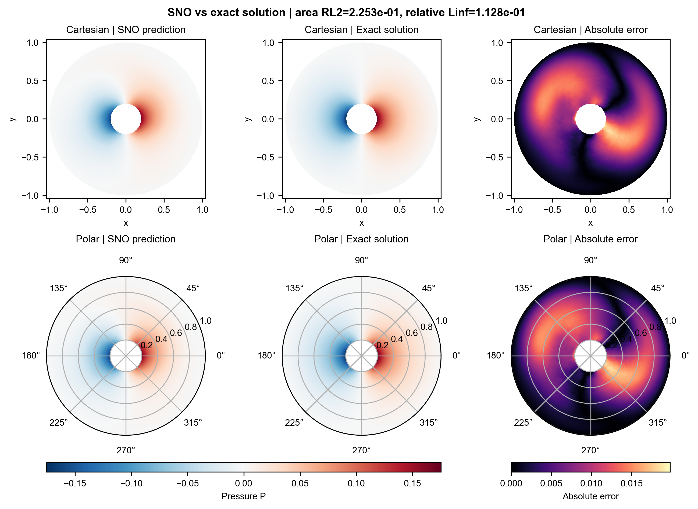
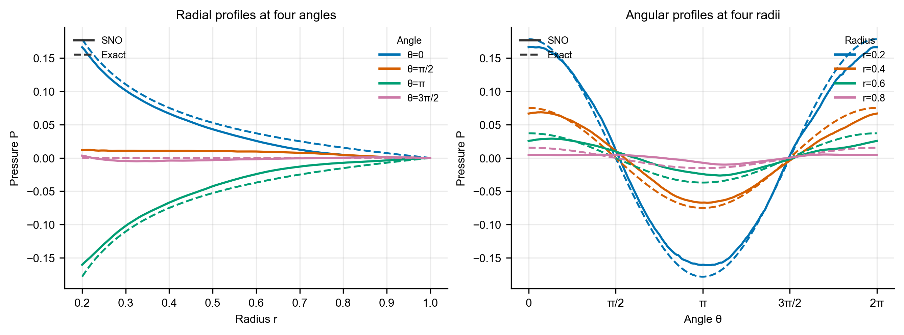

# 极坐标 `p_raw` 测试报告

## 摘要

本实验测试了极坐标下未经边界通量 RMS 校准的压力先验：

$$
P=(r-r_{out})U,
\qquad c_{\sigma_r}=1.
$$

结果表明，`p_raw` 已能重建解析解的主要余弦角向结构和径向衰减趋势，但当前最新 checkpoint 的解析解误差仍较明显，且训练后期的真实样本误差存在较大波动。因此，该方案已经具备可学习性，但尚不能视为稳定、高精度的最终模型。

## 测试流程

1. 在极坐标网格上生成 `p_raw` 先验样本，并从头计算归一化统计量。
2. 训练函数编码器。训练日志达到约 108k 步，OL 实际使用保存于第 100k 步的 FE checkpoint。
3. 以 FE 参数为固定解码基，训练算子学习器。当前可加载的 OL checkpoint 为第 140k 步。
4. OL 训练期间每 500 步记录训练损失、当前训练 batch 的分布内压力相对 $L_2$，以及固定解析解样本的面积加权相对 $L_2$。
5. 使用 $f=0$、$g_n=\cos\theta$、$k=1$ 的圆环解析解进行最终可视化，比较二维压力场、绝对误差、径向剖面和周向剖面。

本次运行采用 `seed=0`、$32\times128$ 极坐标网格和 512 个压力基函数。可视化对应 FE 100k 与 OL 140k checkpoint。

## 最终效果

| 评估对象 | 指标 | 结果 |
| --- | --- | ---: |
| 当前训练 batch，OL 140k | 分布内压力相对 $L_2$ | 3.01% |
| 固定解析解，OL 140k | 面积加权压力相对 $L_2$ | 22.53% |
| 固定解析解，OL 140k | 压力相对 $L_\infty$ | 11.28% |
| 固定解析解训练监控 | 最佳面积加权压力相对 $L_2$ | 7.36%（OL 108k） |

### 整体压力场与误差分布

预测解已经恢复了解析解的主要正负压力区域和径向衰减结构，但绝对误差仍呈现明显的角向分布，说明预测场尚未完全对齐目标余弦模态。

### 径向与周向剖面

剖面对比进一步显示，主要相位和衰减趋势正确，但预测幅值存在偏差；在解析解应接近零的方向上仍有非零分量。

综合数值指标与可视化结果：

- 预测场正确恢复了正负压力区域、主要角向相位和向外边界衰减的整体结构。
- 外边界压力保持为零，说明压力 decoder 的边界约束正常生效。
- 预测幅值仍存在系统偏差；在解析解应接近零的 $\theta=\pi/2$ 和 $\theta=3\pi/2$ 剖面上仍可见非零分量。
- 分布内误差明显低于解析解误差，说明当前主要问题是从 `p_raw` 训练分布到目标边值问题的泛化差距。
- 固定解析解误差在训练后期波动明显，最新 checkpoint 并非训练过程中表现最好的时刻。

## 结论与限制

`p_raw` 证明了“极坐标坐标系 + 压力先验”能够学习目标问题的主要物理结构，但当前结果仍属于阶段性结果：FE 和 OL 均未达到配置中的 300k 步，且只有一个随机种子。现有预检查记录中的物理公式、有限值和 checkpoint 恢复检查通过，但 `boundary_rms` 诊断未通过 5% 阈值，预检查指纹也与最终训练配置不一致，因此不能表述为完整预检查全部通过。

仅凭本实验不能判断性能改善来自坐标变换还是先验形式。下一步应在相同训练预算和评估流程下完成 `p_rms`，再比较两种压力先验的学习曲线、解析解误差和边界通量误差。
