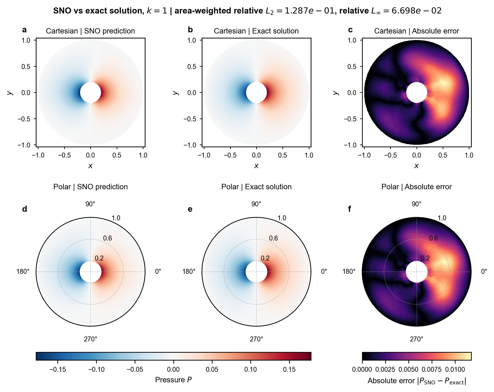
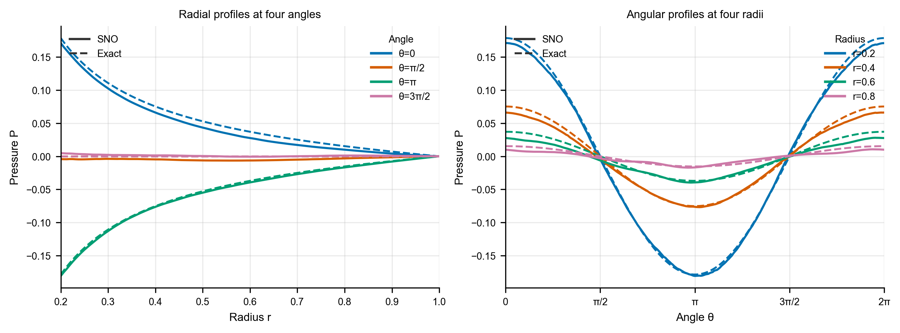

# polar_annulus_sno_code 实施方案

## 项目目标

在固定圆环 $r\in[0.2,1]$ 上学习算子映射：

$$
\Delta P-k^2P=f,
\qquad
P(r_{\mathrm{out}},\theta)=0,
\qquad
g_n=-P_r(r_{\mathrm{in}},\theta).
$$

本次测试采用可解析验证问题 $f=0$、$g_n=\cos{\theta}$ 和 $k=1$，以直接检验 SNO 对压力场及边界条件的预测能力。

## 实施流程

1. Function Encoder 将压力场 $P$ 与源项 $f$ 编码为 latent；Operator Learner 接收源项、内边界通量和 $k$，预测压力 latent。压力解码器通过外边界 mask 严格满足 $P(r_{\mathrm{out}},\theta)=0$。
2. OL 训练时从先验分布持续采样，并用独立小批量记录 latent 误差、物理场相对 $L_2$ 和 checkpoint。
3. 解析测试恢复 `polar_v3` 的 FE、OL 和归一化参数，仅加载模型参数推理；随后在高分辨率圆环上将预测场与 `exact_solution.py` 的解析解比较。
4. 评估输出包含场误差、外边界 Dirichlet 误差、内边界通量误差，以及笛卡尔坐标和极坐标下的 $2\times3$ 对比图与典型径向/角向剖面图。

## 测试结果

当前测试使用 `ol_params_latest.msgpack`；应在后续训练完成后以 `ol_params.msgpack` 复核最终结果。

| 指标 | 结果 |
| --- | ---: |
| 高分辨率场相对 $L_2$ | 约 $1.1\times10^{-1}$ |
| 面积加权相对 $L_2$ | 约 $1.3\times10^{-1}$ |
| 相对 $L_{\infty}$ | 约 $7.0\times10^{-2}$ |
| RMSE | 约 $5.0\times10^{-3}$ |
| 外边界最大 $\lvert P\rvert$ | $0$ |
| 内边界通量相对 $L_2$ | 约 $2.4\times10^{-1}$ |

预测场已恢复解析解的主导 $\cos{\theta}$ 空间结构，笛卡尔视图、极坐标视图和剖面曲线均与解析解保持一致趋势。外边界条件由网络结构精确满足；剩余误差主要体现为局部场偏差及内边界通量误差，后者是下一阶段可重点优化的指标。

典型径向与角向剖面（实线为 SNO，虚线为解析解）：

## 可复现入口

- 训练：`train_function_encoder_polar.ipynb`、`train_operator_polar.ipynb`
- 解析测试与可视化：`evaluate_sno_exact_solution.ipynb`
- 解析解：`exact_solution.py`

所有 Python 代码均应在 Miniconda `jax` 环境中运行。
