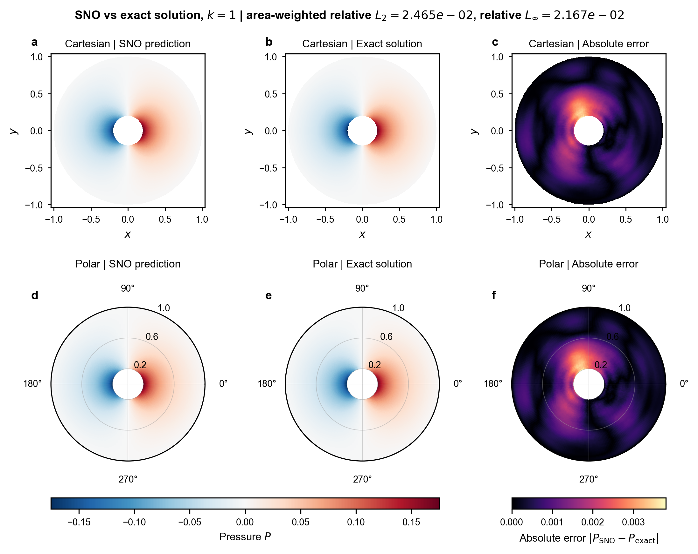
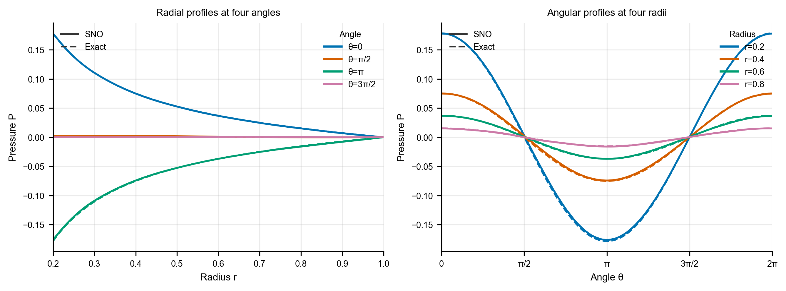

# polar_annulus_sno_code_v4 解析基准测试报告

## 技术摘要

v4 在圆环区域上的 SNO 已完成 Function Encoder（FE）与 Operator Learner（OL）训练，并以单一 Fourier 模态的解析解作为独立物理基准进行检验。最终渲染图显示，在 k = 1、f = 0、gₙ = cos θ 的测试条件下，SNO 压力预测的面积加权相对 L2 为 2.465 × 10⁻²，相对 L∞ 为 2.167 × 10⁻²。预测场恢复了解析解的主导角向结构，典型径向和角向剖面与解析曲线基本重合。

训练末次解析监控在第 300,000 步记录的压力面积加权相对 L2 为 2.515 × 10⁻²，内边界通量相对 L2 为 1.760 × 10⁻¹。这说明场值预测已具备较高精度，但 Neumann 边界通量仍是后续优化的主要方向。外边界 Dirichlet 误差为零，符合压力解码器的结构性边界约束。

## 测试问题与实验设置

### 解析基准

测试区域为圆环 r ∈ [0.2, 1]、θ ∈ [0, 2π)，验证问题为

```math
\Delta P-k^2P=f,
\qquad
P(1,\theta)=0,
\qquad
-P_r(0.2,\theta)=g_n.
```

取 k = 1、f = 0 和 gₙ = cos θ。解析解采用一阶 Fourier 模态的修正 Bessel 函数形式，由 [exact_solution.py](exact_solution.py) 计算。

### v4 训练设置

| 项目 | 设置 |
| --- | --- |
| 先验尺度 | σθ ∼ U[0.5, 2]，σr ∼ U[0.5, 5]；两个尺度按样本独立采样 |
| FE 训练 | 300,000 步；总 batch 为 768；先验生成 chunk 为 256 |
| OL 训练 | 300,000 步；历史文件显示实际每步处理 640 个样本 |
| 离散化 | 32 × 128 极坐标 POD 网格；每个随机训练样本使用 1,024 个 probe 点 |
| 表征维度 | 压力与源项 latent 均为 512 维 |
| FE 物理损失 | `fe_phys_weight = 0`，FE 仅使用场重构损失训练 |
| 随机验证 | OL 每 500 步保存一次独立随机 batch 指标 |
| 解析监控 | FE 与 OL 的解析历史均在第 1 步及其后每 1,000 步记录一次，共 301 条 |

面积加权相对误差使用极坐标面积元 r dr dθ：

```math
E_{L_2,A}
=
\sqrt{
\frac{
\sum_i r_i\bigl(P_i^{\mathrm{SNO}}-P_i^{\mathrm{exact}}\bigr)^2
}{
\sum_i r_i\bigl(P_i^{\mathrm{exact}}\bigr)^2
}
}
```

RMSE 使用同一评估网格上的非加权均方根误差：

```math
\mathrm{RMSE}
=
\sqrt{
\frac{1}{N}
\sum_{i=1}^{N}
\bigl(P_i^{\mathrm{SNO}}-P_i^{\mathrm{exact}}\bigr)^2
}
```

## 定量结果

### 最终渲染测试图

下表数值直接读取自最终保存的场对比图标题，用于描述该次可视化对应的解析测试效果。

| 指标 | 数值 |
| --- | ---: |
| 面积加权相对 L2 | 2.465 × 10⁻² |
| 相对 L∞ | 2.167 × 10⁻² |

### 训练末次解析监控

下表来自 [fe_exact_history.csv](docs/data/fe_exact_history.csv) 和 [operator_exact_history.csv](docs/data/operator_exact_history.csv) 的第 300,000 步记录。

| 阶段 | 压力面积加权相对 L2 | 压力 RMSE | 相对 L∞ | 其他关键指标 |
| --- | ---: | ---: | ---: | --- |
| FE 重构 | 1.455 × 10⁻² | 5.981 × 10⁻⁴ | 1.144 × 10⁻² | f = 0 重构 RMSE：2.481 × 10⁻²；外边界最大误差：0 |
| OL 预测 | 2.515 × 10⁻² | 1.092 × 10⁻³ | 2.219 × 10⁻² | latent 相对 L2：6.271 × 10⁻²；内边界通量相对 L2：1.760 × 10⁻¹；外边界最大误差：0 |

OL 的独立随机验证在第 300,000 步达到物理场相对 L2 = 7.488 × 10⁻³，对应记录见 [operator_training_history.csv](docs/data/operator_training_history.csv)。该随机先验指标与固定解析基准属于不同样本分布，不应直接作为同一误差总体比较。

## 场预测与解析解对比

预测场与解析解在笛卡尔和极坐标表示下具有一致的正负分布及主导 cos θ 结构。误差主要集中在内圆附近及局部角向区域；误差色标的最大值约为 3.5 × 10⁻³，明显低于压力场的峰值幅值。该图同时证明了外边界零压力条件在两种坐标视图中均被严格满足。



## 径向与角向剖面

在 θ = 0、π/2、π、3π/2 的径向剖面，以及 r = 0.2、0.4、0.6、0.8 的角向剖面上，SNO 实线与解析虚线在视觉上基本重合。外半径处所有径向曲线收敛至零，与 Dirichlet 边界条件一致。相比场值误差，内边界通量的相对误差仍较大，因此后续应优先检查边界编码与通量约束的训练权重。



## 结论与边界

本次测试支持以下结论：

- FE 已能以约 1.5% 的面积加权相对 L2 重构该解析压力场。
- OL 对该解析算例实现了约 2.5% 的面积加权相对 L2 压力预测精度，并正确恢复空间结构与外边界条件。
- 内边界通量相对 L2 仍为约 17.6%，不能仅以场值精度替代边界导数精度的判断。

该报告仅覆盖 f = 0、一阶角向模态和 k = 1 的固定解析切片。它是具有物理解释性的验证基准，但不能单独代表整个连续先验矩形、不同 Fourier 模态或不同 k 的泛化能力。后续应增加尺度矩形角点、不同相位/模态以及不同 k 的独立解析测试。

## 可复现性说明

本报告的 GitHub 快照包含 [FE 配置](docs/data/config_fe.json)、[运行配置](docs/data/config.json)、三份 CSV 历史和两张最终图。原始 `out_polar_annulus_sno_v4` 目录被仓库规则忽略，因此报告引用的是 `docs/data/` 与 `docs/images/` 中的已版本化副本；后续重跑实验时应同步更新这些副本。

输出目录保存了 `config.json` 和 `config_fe.json`，但未保存独立的 `config_ol.json`。此外，保存的公共配置中 OL 解析监控间隔为 5,000 步，而实际 `operator_exact_history.csv` 显示的记录间隔为 1,000 步；OL 的实际 batch 也只能由 `samples_seen` 反推为 640。上述差异不改变本次已保存的预测图和误差记录，但会影响对 OL 训练过程的精确复现，建议后续运行始终保存阶段独立的 OL 配置快照。
