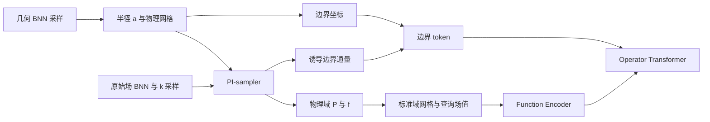

# 任意内边界环域 SNO 实施方案

> **定位**：在几何变化的环域上学习 $\Delta P-k^2P=f$ 的前向算子。Function
> Encoder 与 Transformer 在统一标准域工作；PDE、边界算子和 FEM 对照始终在物理域解释。

## 1. 问题定义

每个样本的物理域为

$$
\Omega_\Gamma=\{(r,\theta):a(\theta)\le r\le b(\theta)\},
\qquad b(\theta)=5a(\theta),
$$

控制方程为

$$
\Delta P-k^2P=f.
$$

外边界满足 $P|_{r=b(\theta)}=0$。内边界使用项目约定的非单位化算子

$$
\mathcal B_aP=
\left(-e_r+\frac{\dot a}{a}e_\theta\right)\cdot\nabla P,
\qquad \dot a=\frac{\mathrm da}{\mathrm d\theta}.
$$

因此，目标工况的边界通量写为

$$
g_{\mathrm{target}}(\theta)=
\cos\theta+\frac{\dot a(\theta)}{a(\theta)}\sin\theta.
$$

这里的分母是 $a(\theta)$，而不是单位法向量所需的 $\sqrt{a^2+\dot a^2}$；训练、推理与 FEM 对照必须使用同一约定。

## 2. 标准域与几何映射

FE 与 Transformer 的标准域固定为

$$
\hat\Omega=\{(\rho,\theta):0.2\le\rho\le1.0\}.
$$

内边界半径由几何 BNN 产生：

$$
a(\theta)=0.12+0.08\tanh\!\bigl(0.3\,r_{\mathrm{BNN}}(\theta)\bigr).
$$

在 $b=5a$ 下，标准域到物理域的映射可简化为

$$
r(\rho,\theta)=5\rho a(\theta),
\qquad
(x,y)=r(\rho,\theta)(\cos\theta,\sin\theta).
$$

|空间|用途|
|---|---|
|标准域 $(\rho,\theta)$|POD 网格、probe 点、CNN branch 输入与 trunk 重构|
|物理域 $(x,y)$|PI-sampler、$\Delta P$、边界通量、FEM 与可视化|

不应把固定环域的极坐标拉普拉斯直接用于变几何问题。若在物理域计算残差，必须通过 $\Phi^{-1}$ 将物理点映回标准域后，对 $P(\Phi^{-1}(x,y))$ 关于物理坐标自动微分。

## 3. 数据生成与批结构

### 3.1 PI-sampler

对原始 BNN 场 $P_{\mathrm{BNN}}$ 使用

$$
P(x,y)=\bigl(r-b(\theta)\bigr)P_{\mathrm{BNN}}(x,y),
$$

从而在外边界严格满足 $P=0$。源项通过物理笛卡尔坐标的 Hessian 计算：

$$
f=\Delta_{x,y}P-k^2P.
$$

训练通量由同一构造场经 $\mathcal B_a$ 诱导，而非将目标通量直接塞入随机样本。这样 $(P,f,g,k)$ 是自洽的 PDE 样本。

### 3.2 `SampleBatch` 契约

|字段|说明|
|---|---|
|`pod_coords`、`probe_coords`|所有样本共享的标准域坐标|
|`pod_phys_coords`、`probe_phys_coords`|每个几何对应的物理坐标|
|`u_pod`、`f_pod`、`u_probe`、`f_probe`|标准域采样位置对应的物理解与源项|
|`boundary_coords`|物理内边界点 $[x_b,y_b]$|
|`boundary_flux`|与 $\mathcal B_a$ 一致的诱导通量|
|`k_values`|每个样本的 PDE 参数|
|`geom_params`|几何 BNN 参数，用于映射、通量与物理残差|

**关键约束**：标准域坐标在一个有效批次中必须共享；物理坐标随几何变化。否则 FE 的共享 trunk 会把不同几何上的场值错配到同一坐标。

## 4. Function Encoder

FE 由两个 CNN branch（分别编码 $P$ 与 $f$）和一个标准域共享 trunk 构成：

$$
z_P=E_P(P),\qquad z_f=E_f(f),
$$

$$
\hat q(\hat x)=\frac{1}{\sqrt{n_{\mathrm{basis}}}}
\sum_{j=1}^{n_{\mathrm{basis}}}z_jT_j(\hat x).
$$

全局归一化统计量由 PI-sampler 数据估计，分别用于 $P$ 与 $f$。

### 4.1 训练策略

当前默认 `fe_loss_fn` 只启用标准域上的数据重构损失：

$$
\mathcal L_{\mathrm{data}}=
\mathrm{MSE}(\hat P,P)+\mathrm{MSE}(\hat f,f).
$$

代码已实现 `physical_residual_loss`，其正确做法是在物理坐标上计算

$$
\mathcal L_{\mathrm{phys}}=
\mathrm{MSE}\!\left(
\frac{\Delta_{x,y}\hat P-k^2\hat P-f}{\sigma_f}
\right),
$$

但该项目前在默认损失中**关闭**，原因是它需要穿过逆几何映射进行二阶自动微分，计算成本较高。推荐顺序是：先用 $\mathcal L_{\mathrm{data}}$ 完成形状和重构验证，再以小批量、较小权重启用物理项。

### 4.2 训练池

变几何样本生成开销较高，`train_fe_with_pool` 可将固定形状的 `SampleBatch` 预生成到 CPU 内存，并保存为 `fe_pool.pkl.gz`。训练时仅将选中的一个批次传输到设备，可降低重复生成和显存压力。该池、归一化统计量与检查点必须使用同一配置版本。

## 5. Operator Transformer

Transformer 学习

$$
(z_f,\,[x_b,y_b,g_b],\,k)\mapsto z_P.
$$

|token|构造|包含的信息|
|---|---|---|
|源项 token|将 $z_f$ 切分为 `seq_chunks` 段|源项函数表示|
|条件 token|将 $[x_b,y_b,g_b]$ 分块|几何与边界通量|
|参数 token|将 $k$ 线性嵌入|PDE 参数|

几何没有单独的额外 token，因为内边界坐标已经显式编码几何。Transformer 输出预测 $\hat z_P$，以 latent MSE 训练，并由共享 trunk 在标准域重构解场。

## 6. 推理与 FEM 对照

### 6.1 推理步骤

1. 固定目标几何参数，生成 $a(\theta)$、物理边界坐标与标准/物理网格映射。
2. 构造目标源项（常见基准为 $f=0$）。
3. 用 `target_boundary_flux_from_problem` 计算 $g_{\mathrm{target}}$，而不是使用随机 sampler 的诱导通量。
4. 编码源项得到 $z_f$，组装源项、边界和 $k$ token。
5. Transformer 预测 $\hat z_P$，FE trunk 在标准域重构 $\hat P$；需要物理图像时再通过 $\Phi$ 映射坐标。

### 6.2 FEM / PCG 接口

`data/` 中的 MATLAB 文件用于独立 FEM 参考解、重构核验和 PCG warm start 比较。实验应至少比较：

- SNO 解与 FEM 解的物理域相对 $L_2$ 误差；
- 外边界 Dirichlet 误差与内边界算子残差；
- 零初值、传统初值与 SNO 初值下的 PCG 残差/迭代次数；
- 圆形、方形与五边形等不同几何族的泛化表现。

## 7. 推荐训练顺序与验收门槛

|阶段|目的|验收项|
|---|---|---|
|0. 小配置冒烟测试|验证数据形状与 JAX 编译|映射可逆、无 NaN、token 维度正确|
|1. PI-sampler 验证|验证物理样本自洽|外边界 $P=0$；$f=\Delta P-k^2P$；诱导通量可复算|
|2. FE 数据训练|获得稳定 latent/trunk|$P$、$f$ 的重构 RL2 达标|
|3. FE 物理微调|提升可微物理一致性|物理残差下降且重构不退化|
|4. OL 训练|学习条件到解的映射|latent loss 与重构解 RL2 同时下降|
|5. 独立 FEM 验证|确认真实问题泛化|边界残差、PDE 残差、FEM 误差与 PCG 指标|

## 8. 当前配置基线与文件职责

|项目|当前默认值|
|---|---|
|标准域|`canonical_r_inner=0.2`，`canonical_r_outer=1.0`|
|几何|`geom_base=0.12`，`geom_amp=0.08`，`outer_scale=5.0`|
|参数范围|`k_min=0.2`，`k_max=2.0`|
|离散|`theta_size=128`，`radial_size=32`，`random_probe_points=1024`|
|latent|`n_basis=512`|
|训练|`fe_steps=300000`，`ol_steps=200000`|

|文件|职责|
|---|---|
|`config_varboundary.py`|几何、标准域、网络和训练配置|
|`data_varboundary.py`|映射、PI-sampler、通量、训练池和 token|
|`models_varboundary.py`|FE 与 encoder-only Transformer|
|`train_varboundary.py`|FE/OL 训练、物理残差与检查点|
|`run_train_varboundary.py`|最小训练入口|
|`data/*.m`|FEM、重构与 PCG 对照实验|

## 9. 交付标准

每个可比较实验必须记录几何与训练配置、随机种子、训练池版本、归一化统计量、FE/OL 检查点、训练曲线和独立 FEM 指标。只有在几何映射、边界算子、物理残差和 FEM 对照全部一致时，才将预测作为 PCG 初值或后续工程分析的输入。
